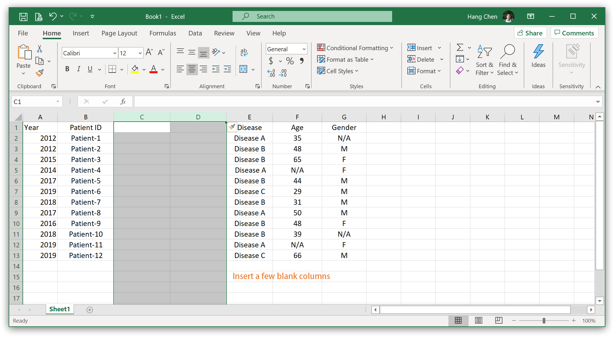
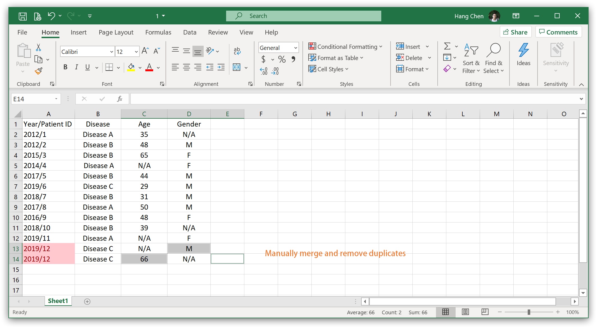
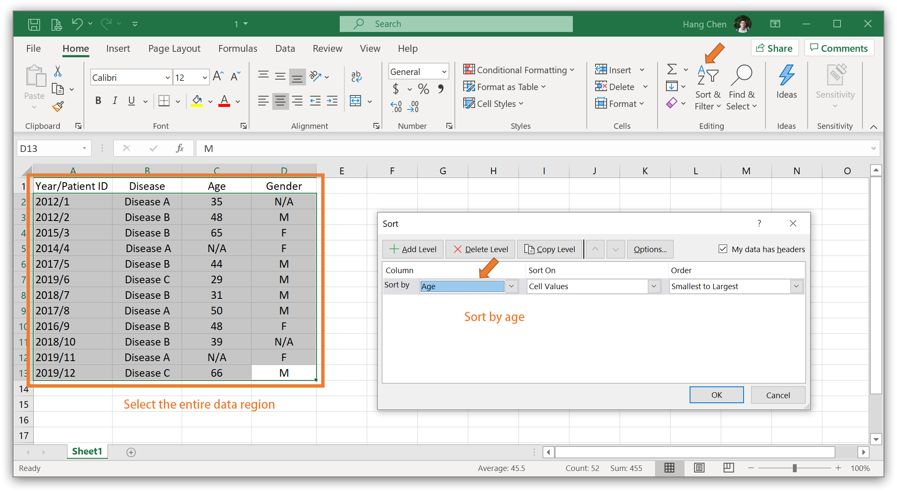

# Fast medium-scale data processing with Excel
When dealing with medium sized datasets (dozens or hundreds of entries), it can be awkward. On the one hand, it might not be worthwhile to specially learn and write an R script for it; on the other hand, it would be very tiresome to do the processing manually. I will introduce herein some handy tools that are perfect for this situation and can expedite the data processing.

## Data trimming
Always do data trimming first. In most cases, data doesn't come neat and uniform. Sometimes you need to combine datasets that have different formatting, sometimes there might be a lot of blank cells or duplicates in a sheet. If the data is not trimmed first, you will very likely lose data entries during analyzing and you won't be able to trace back.

### 1. Replace
**Replacing blank cells with "N/A":**  

- Select the entire desired region manually (do not use Ctrl+A because you may miss some cells)  
- Ctrl+H to bring up the "Find and Replace" window  

> Find what: (leave blank)  
> Replace with: N/A  
- Click "Replace All"  

**Uniforming format:**  

- Select the entire column you want to adjust  
- Ctrl+H to bring up the "Find and Replace" window  

> Find what: Dx  
> Replace with: Disease  
- Click "Replace All"  

### 2. Text to columns
- Insert a few blank columns after the column you want to split  

- Select the column you want to split  
- Go to Data > Text to Columns  

- If you want to split by symbols (e.g., " ", "/", "-", "_"), select Delimited; if you want to split by character count, select Fixed Width  

- Next and Finish

### 3. Concatenate columns
- After the columns you want to combine, insert a blank column  
- Input something like this:  
> you can use any delimiter you want, e.g., " ", "/", "-", "_"  
> you can concatenate more than two columns, just use "," to separate the values  

- autofill the column by dragging  

### 4. remove duplicates (for manual removing, use highlight)
**automatic:**  

- make sure you finished the "1. Replace" step   
- Select the entire data region  
- Data > Remove Duplicates  
- Select only the column you want with unique values  

- Next and finish  

**semiautomatic:**  

- make sure you finished the "1. Replace" step   
- Select the entire data region  
- Home > Sort & Filter > Custom sort  
- Sort by the column you want with unique values  
- OK  
- Select only the column you want with unique values  
- Home > Conditional formatting > Highlight Cells Rules > Duplicate values (select any color you like)  

- manually remove the duplicates (sometimes you may need to merge info from two rows)  

## Filtering
Filtering is the most common and basic procedure to get your interested data entries. In Excel, there is a "Filter" function in the menu, but I personally prefer not to use it. The major reason is that I would like to keep all the filtered out entries in a separate sheet, so that I can always trace back.

- make sure you finished the "1. Replace" step  
- Select the entire data region  
- Home > Sort & Filter > Custom sort  
- Sort by the column you want to filter by  

- OK  
- Select only the column you want to filter by  
- Home > Conditional formatting > Highlight Cells Rules > Greater Than (select any color you like)  

- cut (Ctrl+X) the highlighted rows, paste into a new sheet, note why they are filtered out  

- You may need to delete the blank rows in the original sheet  
- If you need to filter by another columns, restart from custom sort  

## Cross-reference
This can be tricky and time consuming for most people, therefore I recommend the vlookup() function in Excel, which can automatically retrieve the related info if the keywords are matched. There is similar function called hlookup(), which works horizontally instead of vertically, but I personally have never used it.

### 1. merge data

- make sure you finished the "1. Replace" step   
- prepare the data to be merged  

- in the blank cell of your working sheet that you want to add value, click "fx", search for vlookup  

- Click the input box of Lookup_value: select the keyword in both your working sheet and your reference sheet  

- Click the input box of Table_array: select the entire region of your reference dataset  
- Click the input box of Col_index_num: put 1, 2, 3, etc. The column of the keyword in your reference sheet will be 1, the column after will 2, etc. You can put the number according to the info you want to retrieve  

- Click the input box Range_lookoup: I always put FALSE  
- OK  

- If you want to retrieve multiple columns of values, you can just repeat the vlookup in the following columns  
- select the cells with vlookup, autofill the columns by dragging  

### 2. check missing entries

- make sure you finished the "1. Replace" step   
- in the blank cell of your reference sheet, click "fx", search for vlookup  
- Click the input box of Lookup_value: select the keyword in both your working sheet and your reference sheet  
- Click the input box of Table_array: select the column of keywords in your working sheet  
- Click the input box of Col_index_num: 1  
- Click the input box Range_lookoup: I always put FALSE  

- The "#N/A" are the missing entries in your working sheet  

## data exporting

**manual check:**  

It's inevitable that you will have to do some manual check when all the above procedures are done. There might be a few "#N/A" in your working sheet that were not due to the processing procedures, but due to other factors, such as online database updating.

**paste as value before moving or exporting:**  

To avoid the "#REF!" error, you may just copy everything and paste it as values in a new sheet.
