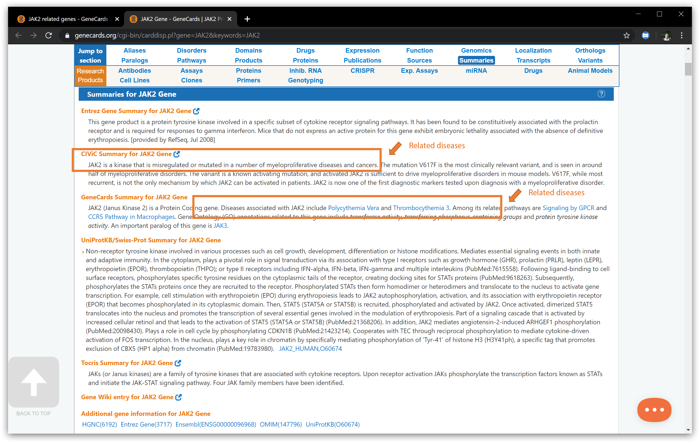
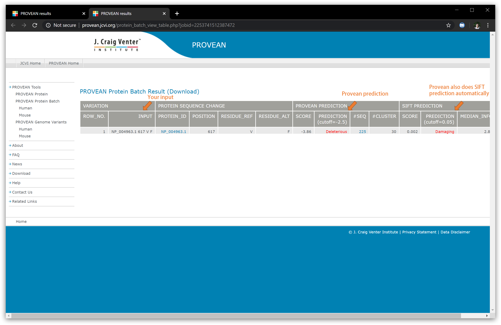
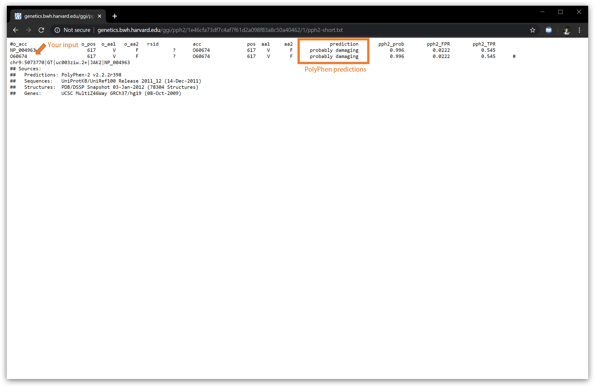
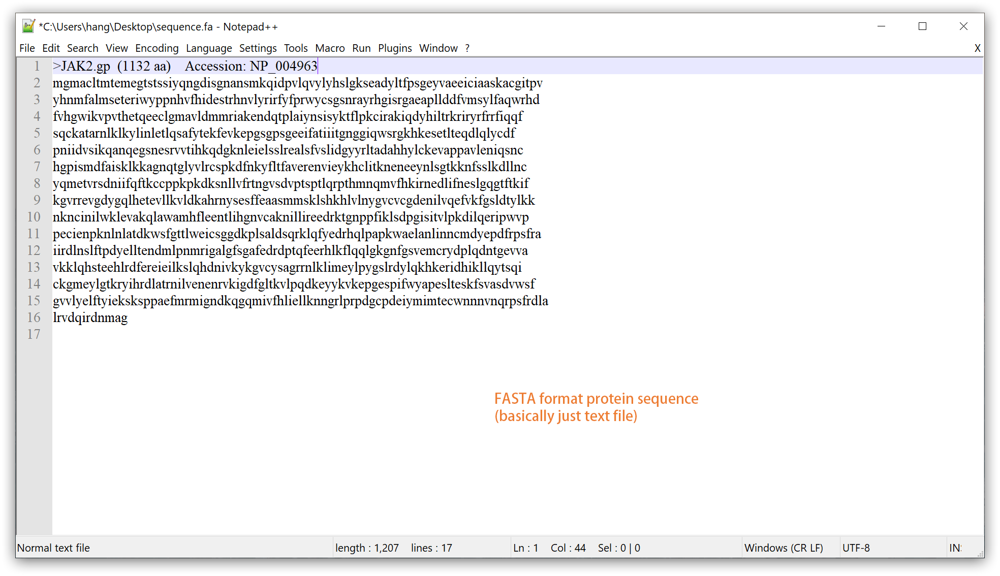
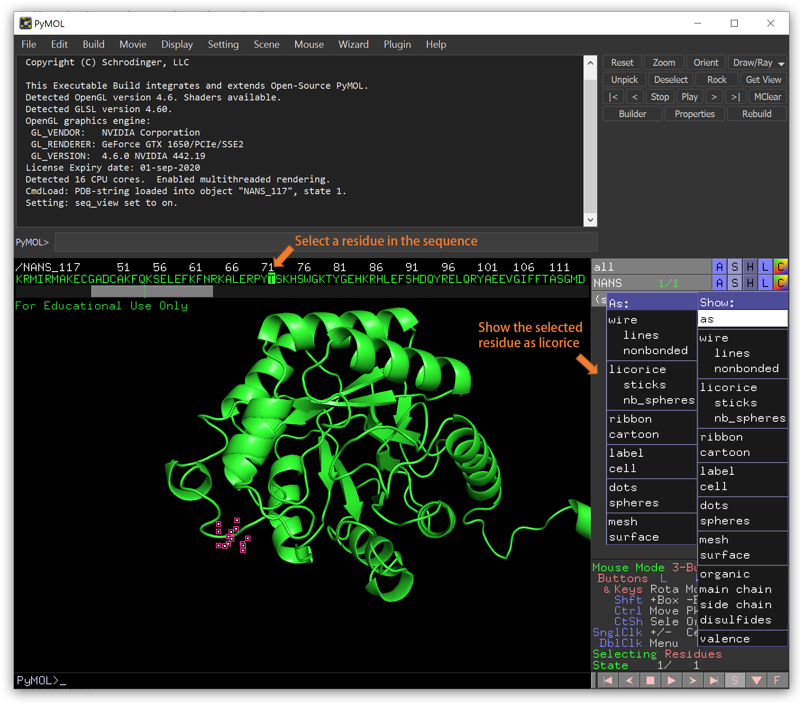
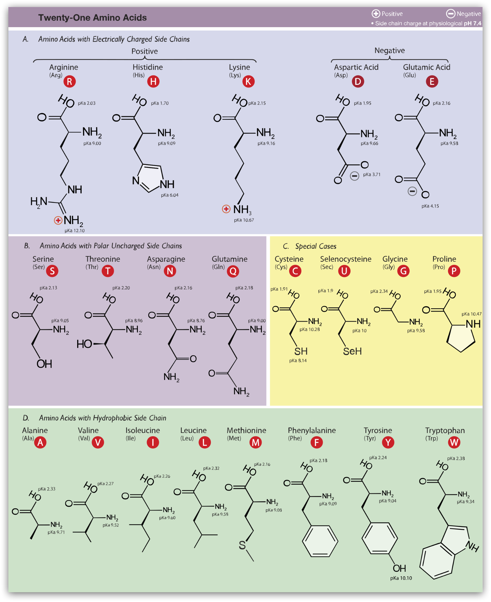

# Preliminary *in silico* research for variants identified by NGS
When you have filtered the variants from raw NGS data, you may find there are still too many of them and it's hard to decide which ones are more valuable for downstream experimental research. Therefore, you may do *in silico* research to get as much info about the variants as possible first.  
*Current version: v1.0.4*

#### Table
1. [*Understand the basic variant info*](https://github.com/chenh19/lab_training/blob/master/in_silico_research.md#1-understand-the-basic-variant-info)
2. [*Check variants in the genome*](https://github.com/chenh19/lab_training/blob/master/in_silico_research.md#2-check-variants-in-the-genome)
3. [*Retrieve more info from online databases*](https://github.com/chenh19/lab_training/blob/master/in_silico_research.md#3-retrieve-more-info-from-online-databases)
4. [*Predict variant deleteriousness*](https://github.com/chenh19/lab_training/blob/master/in_silico_research.md#4-predict-variant-deleteriousness)
5. [*Predict protein modification site*](https://github.com/chenh19/lab_training/blob/master/in_silico_research.md#5-predict-protein-modification-site)
6. [*Predict protein structural changes*](https://github.com/chenh19/lab_training/blob/master/in_silico_research.md#6-predict-protein-structural-changes)
7. [*Calculate odds ratio between variants and diseases*](https://github.com/chenh19/lab_training/blob/master/in_silico_research.md#7-calculate-odds-ratio-between-variants-and-diseases)
8. [*Appendix*](https://github.com/chenh19/lab_training/blob/master/in_silico_research.md#8-appendix)

## 1. Understand the basic variant info
- The most basic variant info contains four parameters: **chromosome**, **position**, **reference**, **alternative**. These four parameters may be separated or concatenated with delimiters.  
- Here is a variant example, ```chr9-5073770-G-T```, which means this variant is located at the 5073770th nucleotide of chromosome 9, and the change is from guanine (G) to thymine (T).  
- One thing to note here is that the **position** may vary according to your [reference genome](https://en.wikipedia.org/wiki/Reference_genome), so please double check which one was used when these variants were being processed: **GRCh37/hg19** or **GRCh38**.  


## 2. Check variants in the genome
You may first check the variant location in the human genome, which can give you the info about:  

- the context of the variants (exon/intron/sequence context), so that you can easily find the variants in the reference sequences of the genes
- the NGS reads quality (variants at the end of amplicons are usually false, especially insertion or deletion; read depth; variant allele frequency)
- the rsID for the variants


### i. IGV
[**Integrative Genomics Viewer (IGV)**](https://software.broadinstitute.org/software/igv/) for genome browsing  

- IGV has both desktop applications and a newer web application. Here I'm using desktop version as an example
- To search for specific location in the genome, first open an IGV instance and select genome version, and then search by: ```chr:pos``` (e.g., ```chr9:5073770```)

 
- If you have .bam files (along with .bai files in the same folder), you may directly open the .bam files with IGV and check the sequencing reads by the same way of searching


### ii. NCBI variation viewer
[**NCBI variation viewer**](https://www.ncbi.nlm.nih.gov/variation/view/) for genome browsing 

- NCBI variation viewer is an online genome visualizing tool integrated with more variant info
- To search for specific location in the genome, first select genome version, and then search by the same format: ```chr:pos``` (e.g., ```chr9:5073770```)

- rsID can be useful for the following steps, such as retrieving variant consequences from online databases
- In some cases, rsID may not be automatically annotated for variants, which may require manual checking for rsID by this way


## 3. Retrieve more info from online databases
Once you have checked the quality and context of the variant, you may retrieve more variant-related info from online databases.

### i. GnomAD
- [**GnomAD**](https://gnomad.broadinstitute.org/) is an extensive and trusted database, we use it for raw variant data annotating
- GnomAD has two versions, v2.1.1 is equal to GRCh37/hg19, while v3 is equal to GRCh38, make sure you select the right version before searching  
- In GnomAD, you may search for gene names and then search for special variants. You may also use the "Export to CSV" function to make variant reference libraries for the genes that you are interested in


- Or, you may directly search for variants by: ```chr-pos-ref-alt``` (e.g.,```9-5073770-G-T```)  
- On a variant page, there are three pieces of most important information: **Annotations**, **Population Frequencies**, and **References**


- In the Annotations section, you can find the consequences (e.g., missense, frameshift, etc.), changes (e.g., amino acid and nucleotide changes), and deleteriousness predictions (e.g., benign or deleterious)
- In the Population Frequencies section, you can find the frequency of the varianst in each population. Some variants might be rare globally but common in a specific population. Usually we are looking for variants that are rare (frequency <0.01) in all populations because they are more likely to be disease causative
- In the References section, the info we use most is the rsID from dbSNP. Also, the rsID is hyperlinked to the NCBI SNP page, where you can find more details of the consequences and changes of the variants


### ii. NCBI
[**NCBI SNP**](https://www.ncbi.nlm.nih.gov/snp/)

- Search by ```rsID``` (e.g., ```rs77375493```)

- You may first check if the Alleles are correct. In some cases, you may be directed to a SNP page according to the location of the variant, but the allele change is actually novel and not available in the database. You may consider this to be a novel variant

- In the Genomic Placements section, you can find the positions of the same variant in different genomic reference sequences

- In the Gene section, you can see the consequences and changes of the same variant varying in different mRNA and protein isoforms. If you use GnomAD as the variant reference library for annotating, you'll find that GnomAD always use the canonical sequences for genes. In many cases, the canonical sequences are not necessarily the most prevalent or relevant sequences, and you'll need to do some extra work to determine which isoforms you want to study. Once the isoforms are confirmed, you can get the accurate mRNA or protein changes

[**NCBI Nucleotide**](https://www.ncbi.nlm.nih.gov/nucleotide/) for RefSeq

- The most common sequences we use for genes are the mRNA sequences
- You may search for RefSeqs by ```gene homo sapiens```. Do remember to select mRNA on the left

- There might be multiple RefSeqs, select the ones for your interested isoforms
- There might also be multiple RefSeqs for the same isofroms from different accessions, I would suggest selecting the ones with refseq starting with "NM_" ([difference between XM_ and NM_](https://www.ncbi.nlm.nih.gov/books/NBK50679/#RefSeqFAQ.what_is_the_difference_between))  
- You may download the sequences for the following steps. You may open the sequence files with [SnapGene Viewer](https://www.snapgene.com/snapgene-viewer/)


[**NCBI PubMed**](https://pubmed.ncbi.nlm.nih.gov/) for existing functional studies

- You may search for previous research on the variants that you are interested in
- The most common search format is: ```gene amino_acid_change disease``` (e.g., ```JAK2 V617F Myeloproliferative Neoplasm```)


### iii. GeneCards
[**GeneCards**](https://www.genecards.org/) for gene summaries

- You can find summaries of genes, including the related diseases, which can be very useful in some cases


### iv. UniProt
[**UniProt**](https://www.uniprot.org/) for protein info

- UniProt is a protein database where you can find details of the gene products, including protein functions, domains, active sites, isoforms, diseases, interacting proteins, subcellular locations, etc.  


- You may check whether the variants are at or close to the active sites
- You may also check which specific domains or regions the mutated residues are located in, and it may give you some hints of the functional results of the variants

### v. PDB
[**PDB**](https://www.rcsb.org/) for protein structures

- PDB is a protein structure database, if your interested proteins have been structurally determined by previous studies, you may utilize the structure models to see the 3D location of the mutated residues and may use them as templates to do structural change predictions


### vi. Hotspots
- [**3D Hotspots**](https://www.3dhotspots.org/)  
  

- [**Cancer Hotspots**](https://www.cancerhotspots.org/)  
  

- Some variants may happen at hotspots, which may give you some extra info of the variants


## 4. Predict variant deleteriousness
Although you can find varaint deleteriousness in online databases like GnomAD, you may still want to do the prediction manually sometimes. There are many prediction tools with different algorithms (based on conservation, structure, etc.) available online. The table 2 in this paper has well summarized these tools: [DOI:10.1038/gim.2015.30](https://doi.org/10.1038/gim.2015.30). The most common tools we use are PROVEAN and PolyPhen, here I'll show how to do predictions with them. Other prediction tools should function in a very similar way.  

Your priority should always be protein prediction, if protein prediction is not applicable, such as splice varaints, you can do genome prediction instead.  

Sometimes the results from different programs might discord, so you may save the deleteriousness predictions from each program. If the results accord, the predictions are more likely to be real.

[**Provean Protein**](http://provean.jcvi.org/protein_batch_submit.php?species=human)
- Use reference sequences starting with "NP_" for protein prediction as much as possible
- If for one protein isoform there are multiple sequences labeled with "NP_", select the shorter one, which is usually the more canonical one

- Input:

- Output:


[**Provean Genome**](http://provean.jcvi.org/genome_submit_2.php?species=human)
- If you are predicting varaints with genomic positions and your variants were originally aligned to GRCh38, you may need to change the varaint positions. One way to do it is searching the rsIDs in [NCBI SNP](https://www.ncbi.nlm.nih.gov/snp/), rsIDs are unique for each variant and you can find the position of the same variants if they were align to GRCh37/hg19. Another way is using online tools, such as [NCBI Genome Remapping Service](https://www.ncbi.nlm.nih.gov/genome/tools/remap) and [UCSC Lift Genome Annotations](https://genome.ucsc.edu/cgi-bin/hgLiftOver).   

- Input:

- Output:


[**PolyPhen**](http://genetics.bwh.harvard.edu/pph2/bgi.shtml)
- Use reference sequences starting with "NP_" for protein prediction as much as possible
- If you are predicting varaints with genomic positions and your variants were originally aligned to GRCh38, you may need to change the varaint positions. One way to do it is searching the rsIDs in [NCBI SNP](https://www.ncbi.nlm.nih.gov/snp/), rsIDs are unique for each variant and you can find the position of the same variants if they were align to GRCh37/hg19. Another way is using online tools, such as [NCBI Genome Remapping Service](https://www.ncbi.nlm.nih.gov/genome/tools/remap) and [UCSC Lift Genome Annotations](https://genome.ucsc.edu/cgi-bin/hgLiftOver).   

- Input:

- Output:


- PolyPhen uses a relatively old database. In rare cases for protein prediction, the "o_pos" might be wrong and you can easily spot it by comparing "o_pos" with your input position. I would suggest that you remove those prediction results. If you really need the results, you may have to search for the previous UniProt IDs for the proteins. So far I have only seen one protein like this, which is CFHR4, and it requires a dated protein ID, Q5DVJ7, for prediction.  


## 5. Predict protein modification site
Post-translational modifications are important for protein property, structure and function. There are many prediction tools available online: [ExPASy](https://www.expasy.org/tools/#ptm), [DTU bioinfo](http://www.cbs.dtu.dk/databases/PTMpredictions/). Here I'll use phosphorylation prediction as an example. Other prediction tools should function in a very similar way.  

[**NetPhos server**](http://www.cbs.dtu.dk/services/NetPhos/)

- Put in your sequence ([FASTA format](https://en.wikipedia.org/wiki/FASTA_format))  
- You may use it to predict the wild type sequences if the S/T/Y residues are gone, or the mutated sequences if new S/T/Y residues are introduced

- Set parameters according to the guidance provided by the tool
- NetPhos uses 0.5 as a cutoff. Residues with scores >0.5 will be called as possible phosphorylation sites (labeled as "yes"), while residues with scores <0.5 will not be called (labeled as ".")

- Submit and run
- Output:

- In the results, the left box is the amino acid residues (positions and amino acids), the right box is the results ("yes" means it's likely to be a phosphorylation site, "." means it's unlikely to be one)
- Taking "**18 S**" as an example, it's the 18th amino acid and it's a Serine. The prediction program found 7 kinases for this Ser residue, which are listed in descending order by scores. The first three kinase, unsp, PKC, and cdc2, are predicted to be possible kinases for this Ser (I.e., Ser18 might be a phosphorylation target site of unsp, PKC, and cdc2)


## 6. Predict protein structural changes
Predict the structures of proteins with variants and compare them with wild type structures.

### i. I-TASSER prediction

[**I-TASSER server**](https://zhanglab.ccmb.med.umich.edu/I-TASSER/)

- Input:


- Output: also PDB files, see below for analyzing

### ii. PyMol visualizing
**PyMol** is a useful desktop application for protein structure visualization. You may [download it from here](https://pymol.org/2/).  

- You may also need to download the [free educational license](https://pymol.org/edu/?q=educational)  
- You can use PyMol in a very intuitive way with mouse ([a quick tutorial](https://pymol.org/dokuwiki/doku.php?id=mouse:two_button))
- Once you've downloaded the .pdb file from PDB website, you can open it with PyMol and use mouse to inspect the protein


- You may want to highlight some residues on the protein where mutation happened, here is what I usually do: ```select```, ```show as```, and ```color```



- You may want to export the current view as an image, here is what I usually do using command lines: ```ray pixel,pixel```,  ```png filename``` (e.g., ```ray 2000,2000```,  ```png export-1```), the exported file will be in the same folder as your PDB files


- Once you've received the prediction results from I-TASSER server, you may want to compare the structural difference between the predicted ones and the original (wild type) ones, here is what I usually do using command lines: ```align A, B``` (e.g., ```align NANS_WT,NANS_Variant```)


- Sometimes, single amino acid changes may not cause drastic protein structural changes. In that case, you may look into the proximal residues of the mutated residues and try to find potential linkages.  


## 7. Calculate odds ratio between variants and diseases
Last but not least, you may calculate the [**odds ratio**](https://www.socscistatistics.com/biostatistics/default2.aspx) and the [**p value**](https://www.socscistatistics.com/tests/chisquare/default.aspx) to see the association between the variants and specific diseases.

## 8. Appendix
- [**An online statistics calculator website**](https://www.socscistatistics.com/)

- **Amino acids:**  
  

- **Amino acid codons:**  
  
