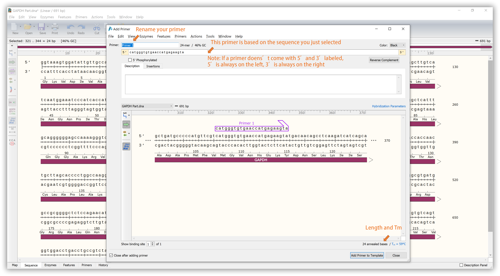
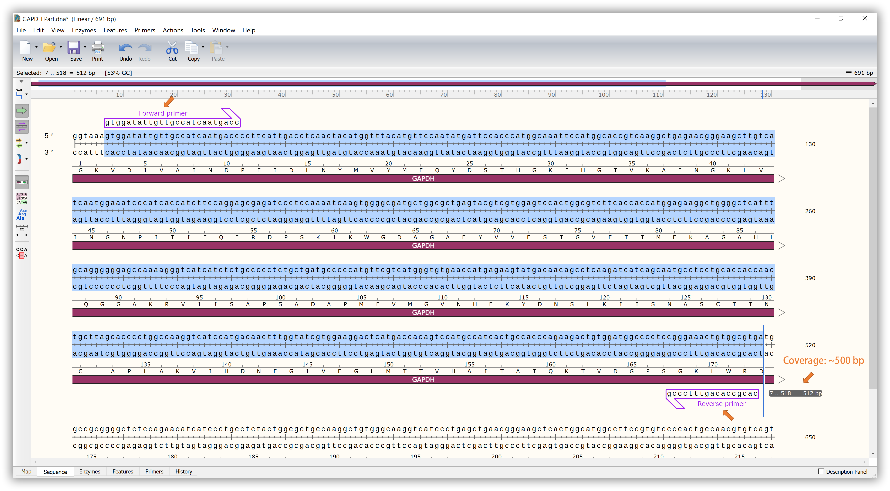
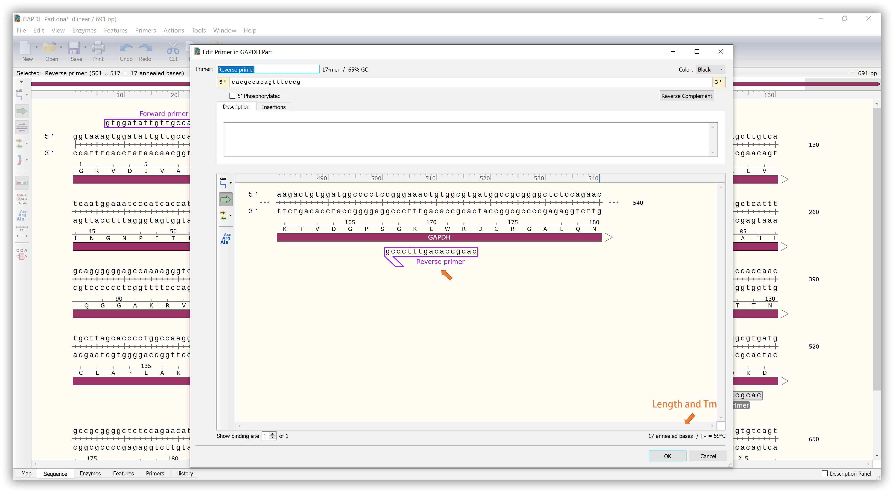
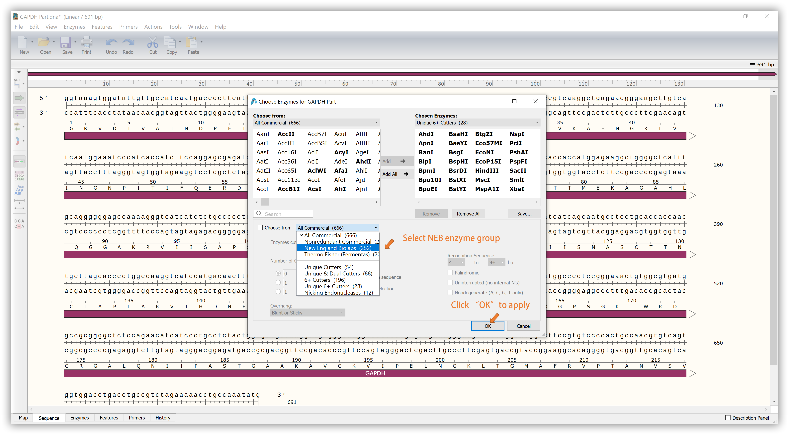
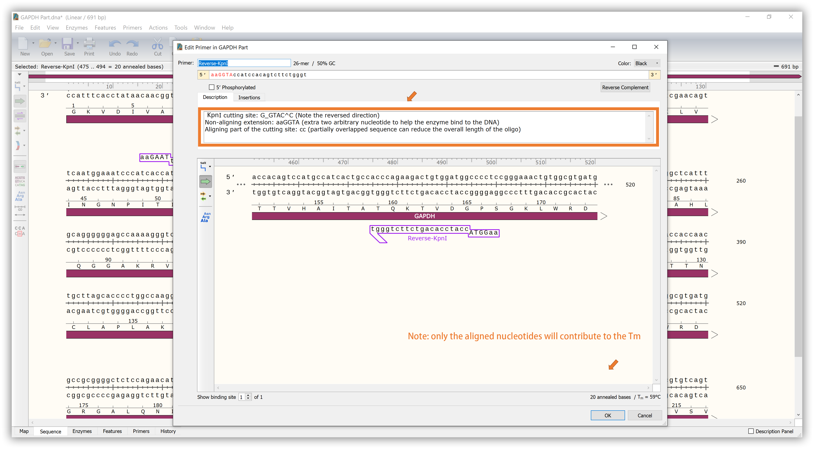

# DNA Oligo designing principles
This tutorial focuses only on the designing of DNA oligos, which is mostly based on my bench experience and might be slightly different from text books or general protocols. Basic principles of PCR, qPCR, sequencing, and CRISPR will not be discussed here.  
*Version: v1.0.1*

#### Table
1. [*Background*](https://github.com/chenh19/lab_training/blob/master/Oligo%20designing.md#1-background)
2. [*Primers for PCR*](https://github.com/chenh19/lab_training/blob/master/Oligo%20designing.md#2-primers-for-pcr)
3. [*Primers for sequencing*](https://github.com/chenh19/lab_training/blob/master/Oligo%20designing.md#3-primers-for-sequencing)
4. [*Guide RNAs for gene knock-out*](https://github.com/chenh19/lab_training/blob/master/Oligo%20designing.md#4-guide-rnas-for-gene-knock-out)
5. [*Prime editing gRNAs for variants knock-in*](https://github.com/chenh19/lab_training/blob/master/Oligo%20designing.md#5-prime-editing-grnas-for-variants-knock-in)


## 1. Background
**First of all**, to understand why a ~20 bp sequence can be unique in the whole genome:  

- In general, you may assume that for each nucleotide in a sequence, the probability of it to be A, T, C, or G is 

- Then, for a N bp sequence, the probability of it would be 
- Human genome is about 3 billion bp, so you may express the frequency of the sequence in the whole genome in this way: 
- The sequence being unique in the whole genome means: 
- Solve the function and get the result: 
- Therefore when , a sequence can be considered as unique in the whole genome

**Second**, 3 ways to calculate the Tm ([Understanding melting temperature (Tm)](https://www.idtdna.com/pages/education/decoded/article/understanding-melting-temperature-(t-sub-m-sub-))):  

- Using SnapGene ([Download SnapGene](https://www.snapgene.com/snapgene-viewer/))

- Using online calculator: [NEB Tm calculator for specific PCR enzymes/kits](http://tmcalculator.neb.com/)

- Manual calculation: , where ```A, T, C, G``` means the counts of each nucleotide in the **single-strand** oligos. Do **not** use this unless you don't have access to computers

> Note:   
> 
> - In most cases (e.g., when using Phusion polymerase), SnapGene's Tm would be accurate. If you are using Q5 polymerase, make sure you use the **NEB Tm calculator** because Q5 buffer can increase the Tm.  
> - [Annealing Temperature (Ta)](https://www.labce.com/spg1025560_annealing_temperature_ta.aspx) is slightly different from Tm, although they are often mis-used interchangeably.  
> - Only include the **aligned nucleotides** for Tm calculation. Those nucleotides that doesn't align will not contribute to the Tm.  
> - If you see a sequence without 5' and 3' annotated, by default **the left end is 5'** and **the right end is 3'**.

## 2. Primers for PCR
- DNA oligos are most frequently used in daily PCR experiments. There are different designing skills for different situations
- First of all, here is an example of making a primer in SnapGene: just select a region and use the "Add primer" tool




### i. Primer sets for regular PCR
- DNA Oligo amount: 2 (forward primer for one strand, reverse primer for the other strand)
- Primer Tm: ```58-60 °C``` (This saves time because for every PCR you can just set the annealing temp of your PCR program to 58°C without going back to check your primer design)
- Primer length: ```16-32 bp``` (From the calculation in the background you can understand why the minimum length is 16 bp)
- Product length (coverage): ```~500 bp``` (500 bp is usually good for one-time Sanger sequencing)




> Note:   
> 
> - **GC%** is usually another specs mentioned in other tutorials, but if Tm and Length are within range, GC% will be good and you don't have to worry.  
> - A set of primers can also amplify **single-strand DNA templates**. In the first cycle, only one primer will work, but once double-strand DNA template forms, both primers will work and amplify the double-strand DNA.
> - If you are doing genotyping, please remeber to use the **genomic DNA maps** for primer designing, not the mRNA/cDNA maps.

### ii. Primer and probe sets for qPCR
- DNA Oligo amount: 2 or 3 (forward primer for one strand, reverse primer for the other strand, maybe a probe in between for either strand)
- Primer Tm: ```58-60 °C``` (qPCR usually uses a 2-step program, where the temp of the second step is typically set to 60 °C)
- Primer length: ```16-32 bp```
- Product length (coverage): ```100-200 bp``` (for fast qPCR process)
- Probe Tm: ```5-10 °C higher than primers' Tm``` (some qPCR kits use SYBR and don't require probes, while some other qPCR kits use fluorescent probes, such as Taqman)


### iii. Adding RE sites
- In some cases, you would want to add Restriction Endonuclease cutting sites to both ends of your product, so that it can be later integrated into an expression vector
- NEB has a list of all its available REs: [NEB RE list](https://www.neb.com/products/restriction-endonucleases)
- In SnapGene, you can also show all the available RE sites on your gene map: 



- Here, taking [EcoRI](https://www.neb.com/products/r0101-ecori#Product%20Information) and [KpnI](https://www.neb.com/products/r0142-kpni#Product%20Information) as an example of adding RE sites to PCR products. Here are the RE sites of both enzymes:


- You can just add the RE sites to your primers like this:




> Note:
>
> - Always add 2 random nucleotides before your cutting sites. This is to trick the enzymes into believing that they are binding to the middle of a DNA instead of the ends.
> - When adding the cutting site sequences to the primers, you don't necessarily add the entire sequences, usually you can utilize a few nucleotides in the template sequences.
> - Note that only the aligned nucleotides will contribute to the Tm.

- Illustration of how the PCR will work:


### iv. Site-directed mutation
- Use the tool, [NEBaseChange](http://nebasechanger.neb.com/). Do **not** manually design site-directed mutation primers unless the ones from NEB fail
- This is typically used for **circular plasmids**. After PCR, the amplified DNA will be linear and you can use **DNA ligase** to make it circular again
- This methods can also introduce **insertion** or **deletion** into the plasmids. To design insertion or deletion primers, you can just change the **Desired sequence** in the NEBaseChanger


- How the site-directed mutation primers look like in SnapGene:


### v. Extending short DNA oligos
- DNA Oligo is usually shorter than 60 bp. If you want slightly longer oligos, one way is to order [DNA ultramers](https://www.idtdna.com/pages/products/custom-dna-rna/dna-oligos/ultramer-dna-oligos) from companies, another way is to extend short oligos
- For example, two 60 bp oligos here with 21 bp complementary sequence. Each oligo is both template and primer in this case. Just do a regular PCR and you'll get the full length double-strand DNA (99 bp in this case)


> Note:
>
> - For the complementary sequence, design with the same principles for regular PCR primers


## 3. Primers for sequencing
### i. Sanger sequencing for small PCR products
- Primers for sanger sequencing are basically the same as the primers for regular PCR
- When mixing sequencing samples and primers, always use **only one** primer for each sample (sequencing is unidirectional). If you want to sequence it in both forward and reverse manner, you can sequence twice in separate tubes
- Here are an example of sequencing results. Beginning region (<60 bp): poor quality

- Middle region (60-600 bp): good quality (clean and sharp signal peaks, low background noise)

- End region (>600 bp): poor quality (blurry signal, high background noise)


> Note:
>
> - The variants detected in the poor quality regions should be considered as **false** by default.


### ii. Sanger sequencing for large regions
- To avoid false variants, use the overlapping design
- Typically ```300-400 bp``` between the primes (non-overlapping region)
- The beginning and the end of each sequencing fragment should be overlapped by another sequencing fragment

- Here is an example of sequencing results aligned to the template:


> Note:
>
> - Any variant **shows up for only once (not overlapped)** should be considered as **false**.

### iii. Gene panel designing for NGS
- Paneled-NGS uses hundreds of primers for targeted amplicons. There are many panels available online designed by companies or by community, here is an example: [illumina Gene Panel & Arrary Finder](https://www.illumina.com/products/selection-tools/gene-panel-finder.html#/)


> Note:
> 
> - Usually you don't have to design the paneled oligos yourself.


## 4. Guide RNAs for gene knock-out
When doing CRISPR, you can transfect cells with either plasmids or more direct RNP (gRNA + Cas9 protein)
CRISPR is mostly used in our lab for for gene knock-out or variant knock-in.
Gene knock-out is relatively simple, just make an DSB and use NHEJ to introduce insertion or deletion and therefore cause frameshift (gRNAs are typically at the beginning of the gene, first 1 or 2 exons)


### i. Making gRNA plasmid
- you may follow this protocl


- when selecting the spacers, [Feng Zhang's lab](https://zlab.bio/guide-design-resources), among which IDT is most frequently used by our lab since IDT makes DNA/RNA oligos
usually, one gRNA should be enough to cause small insertions or deletions. If large deletion is needed, you may design two gRNAs at both ends of the desired deletion.

### ii. DNA oligo/ultramer for *in vitro* transcription
- T7 promoter
- Spacer
- Scaffold


## 5. Prime editing gRNAs for variants knock-in
Another frequent application of CRISPR is variant knock-in. Still, you can use either plasmid or RNP. But RNP is preferred, because single clones with SNP are relatively difficult to select in the pool, the higher efficiency provided by RNP can be helpful.
There are many ways to introduce a variants. We currently use the most recent prime editing. Traditional combination of [gRNAs and donor templates](https://horizondiscovery.com/en/applications/crispr-cas9/homology-directed-repair-with-a-plasmid-donor) are not covered in this tutorial. 
Prime editing is relatively complicated but also very compact and high efficient. It doesn't use cell's HDR mechanism, but use reverse transcription instead.
Prime editing uses two gRNA, one introduce the variant, another is for the non-edited strand, which is to increase the variant introduction efficiency

### i. pegRNA for the strand to be edited
- T7 promoter
- Spacer
- Scaffold
- RT (reverse transcription template) + PBS (primer binding site)
- *in vitro* transcription, capping and tailing
> When designing pegRNA, the spacer near the edited site might not have high scores, which is OK, because prime editing uses nickase. If it cut offsite, it will not introduce the variant because the RT won't align, and the nick can be ligated.
> Utilizing or designing RE cutting site for variant detection

### ii. gRNA for the non-edited strand 
PE3b is not practical in many cases. Therefore focusing on PE3 only here.
The secondary gRNA should be 40-90 bp away from the edited site
Doesn't have RT and PBS, only introduce a nick, will not introduce any sequence change


## Appendix

Tm calculator for specific PCR enzymes/kits:
[Tm calculator](http://tmcalculator.neb.com/)

Calculate molecular weight by sequence:

[Calculator 1](http://molbiol.edu.ru/eng/scripts/01_07.html)
[Calculator 2](https://www.bioinformatics.org/sms2/dna_mw.html)
